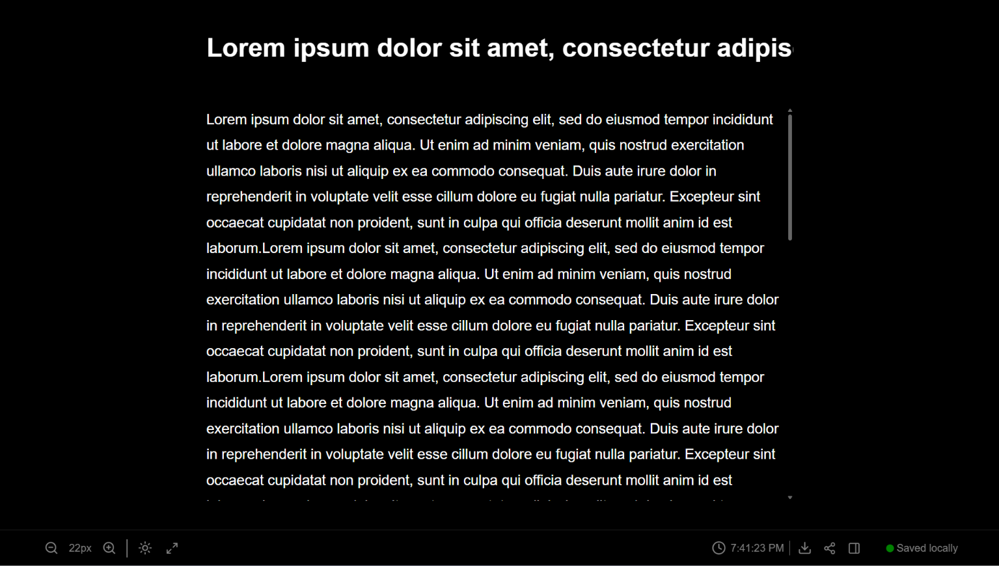
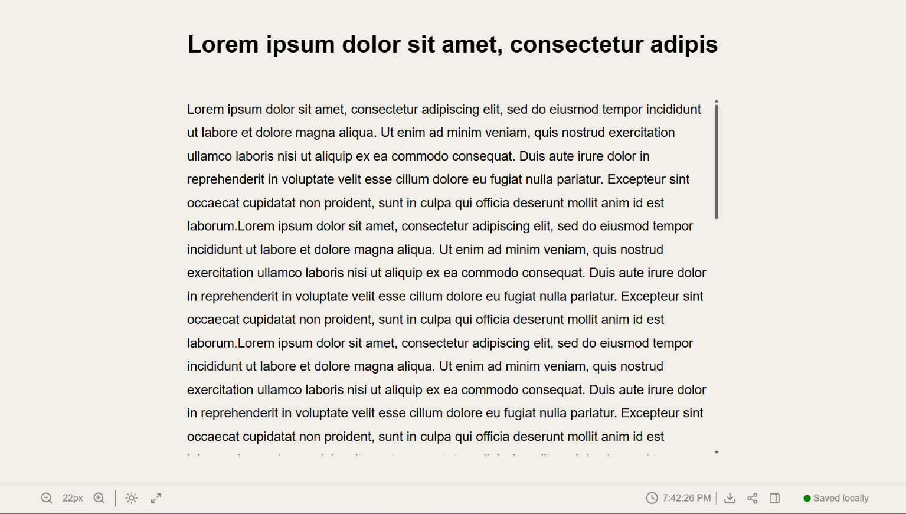

# Werite

> A minimal, collaborative space for notes, ideas, and drafts.

[Open Werite](https://werite.app)

## About

Werite is a minemal document editor built for writing without the clutter. You can start writing without an account; your anonymous document is saved locally in your browser.

When you need to collaborate, create an account and share documents with other people. Owners can invite members, choose whether they can edit or only view, change their role later, or remove their access.

## Some of it feautures include:

- Create, search, and delete documents
- Autosave with visible saving and saved states
- Share documents by email
- Owner, Editor, and Viewer permissions
- Manage collaborators and remove access
- Export documents as Markdown (`.md`)
- Write without signing in using local browser storage
- Dark and light themes
- Font-size controls, zoom, and fullscreen writing mode

## Screenshots

## Built With

[![React][React.dev]][React-url]
[![TypeScript][TypeScript.dev]][TypeScript-url]
[![Bun][Bun.dev]][Bun-url]
[![Express][Express.dev]][Express-url]
[![Prisma][Prisma.dev]][Prisma-url]
[![PostgreSQL][PostgreSQL.dev]][PostgreSQL-url]
[![Lucide][Lucide.dev]][Lucide-url]

## Contributing

Contributions are welcome : ) Feel free to open an issue or pull request
for improvements, bug fixes, themes, typography options, or UX ideas.

## License

Distributed under the MIT License. See `LICENSE` for more information.

## Try it

Visit [werite.app](https://werite.app) to try the current version

[React.dev]: https://img.shields.io/badge/React-20232A?style=for-the-badge&logo=react&logoColor=61DAFB
[React-url]: https://react.dev/

[TypeScript.dev]: https://img.shields.io/badge/TypeScript-3178C6?style=for-the-badge&logo=typescript&logoColor=white
[TypeScript-url]: https://www.typescriptlang.org/

[Bun.dev]: https://img.shields.io/badge/Bun-000000?style=for-the-badge&logo=bun&logoColor=white
[Bun-url]: https://bun.sh/

[Express.dev]: https://img.shields.io/badge/Express-000000?style=for-the-badge&logo=express&logoColor=white
[Express-url]: https://expressjs.com/

[Prisma.dev]: https://img.shields.io/badge/Prisma-2D3748?style=for-the-badge&logo=prisma&logoColor=white
[Prisma-url]: https://www.prisma.io/

[PostgreSQL.dev]: https://img.shields.io/badge/PostgreSQL-4169E1?style=for-the-badge&logo=postgresql&logoColor=white
[PostgreSQL-url]: https://www.postgresql.org/

[Lucide.dev]: https://img.shields.io/badge/Lucide-000000?style=for-the-badge&logo=lucide&logoColor=white
[Lucide-url]: https://lucide.dev/